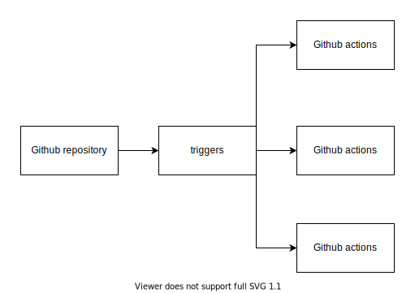

# Github actions demo



Demo of a few of the capabilities of github actions.

- [Deploy create-react-app to AWS](#deploy-create-react-app-static-site)
- [Trigger action on PR](#trigger-action-on-pr)

### Deploy creact-react-app static site

deploy a statically generated site from `create-react-app` using github actions to AWS (s3 + cloudfront hosting).

**Generating the infrastructure:**

```sh
terraform init
terraform plan
terraform apply -auto-approve
```

**Github secrets:**

These are the required secrets needed to run the github action for the static site.


|Secrets   |  description |
|---|---|
| AWS_ACCESS_KEY_ID  |  AWS key ID  |
| AWS_SECRET_ACCESS_KEY  |  AWS access key |
| AWS_CF_DISTRIBUTION_ID  |  AWS Cloud front distribution ID |
| AWS_S3_BUCKET_NAME| AWS S3 bucket name |

### Resources

- [Event trigger](https://docs.github.com/en/actions/reference/workflow-syntax-for-github-actions#onevent_nametypes)
    - [filter pattern cheatsheet](https://docs.github.com/en/actions/reference/workflow-syntax-for-github-actions#filter-pattern-cheat-sheet)
    - [event branch filters](https://docs.github.com/en/actions/reference/workflow-syntax-for-github-actions#onpushpull_requestbranchestags)
    - [event file path filters](https://docs.github.com/en/actions/reference/workflow-syntax-for-github-actions#onpushpull_requestpaths)
    - **Caveat:** branch filter won’t work for pull request event trigger because it also references (`**/master` or `**/merge`), see solution in workflow
- [Environment](https://docs.github.com/en/actions/reference/workflow-syntax-for-github-actions#env)
    - [Environment variables](https://docs.github.com/en/actions/reference/environment-variables)

- [Guides](https://docs.github.com/en/actions/guides)
    - [nodejs](https://docs.github.com/en/actions/guides/building-and-testing-nodejs)
    - [python](https://docs.github.com/en/actions/guides/building-and-testing-python)
    - [ruby](https://docs.github.com/en/actions/guides/building-and-testing-ruby)
- [handling outputs](https://docs.github.com/en/actions/reference/workflow-commands-for-github-actions#using-workflow-commands-to-access-toolkit-functions)

- [Building Actions JS](https://docs.github.com/en/actions/creating-actions/creating-a-javascript-action)
    - [@actions/toolkit](https://github.com/actions/toolkit)

- [Security](https://docs.github.com/en/actions/learn-github-actions/security-hardening-for-github-actions)

#### Plugins

- [actions/checkout](https://github.com/actions/checkout)
- [setup-node](https://github.com/actions/setup-node)
- [chrislennon/action-aws-cli](https://github.com/chrislennon/action-aws-cli)

### Trigger action on PR 
